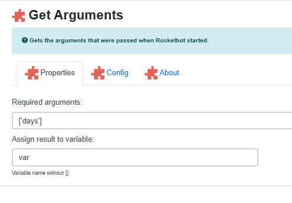

# FAQ


---
## ¿Cómo pasar argumentos a un Robot mediante Batch?
<details>
<summary>Informacion del comando</summary>

- ID: getArguments
- Group: System++
</details>  

Con el comando 'Obtener argumentos' podrás pasar argumentos a través del .bat. En el comando se indica de la siguiente manera: `['arg']` y en el .bat: `arg=param`. 
Ejemplo: 


```
cd C:/Rocketbot
rocketbot.exe -db="C:\bot.db" -start="main" -execution_mode="bat" --update-drivers days=1
```


---
## ¿Cómo pasar parámetros al Bot mientras se desarrolla en Rocketbot Studio?
<details>
<summary>Informacion del comando</summary>

- ID: getArguments
- Group: System++
</details>  
 
Para poder hacer pruebas en desarrollo, debes abrir rocketbot.exe desde una terminal posicionandote en la carpeta raíz de Rocketbot con el siguiente comando:  
 `.\rocketbot.exe -test="hola mundo" -prueba="lorem ipsum"`  

De esta forma abres Rocketbot Studio con los parámetros `test` y `prueba` 

---

